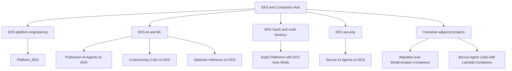

# EKS and Containers Hub

A curated portfolio of Amazon EKS, Kubernetes, containers, and AI/ML platform-engineering projects maintained by [Ramu-DE](https://github.com/Ramu-DE).

## Purpose

This repository provides one discoverable entry point for related projects. Individual repositories remain independent and retain their own source, issues, releases, and lifecycle.

## Amazon EKS platform engineering

### [Amazon EKS Deep Dive](https://github.com/Ramu-DE/eks-deep-dive)

Detailed, diagram-driven guide covering EKS architecture, Auto Mode, networking, Pod Identity, storage, load balancing, security, reliability, scaling, upgrades, rollback, cost, advanced networking, Hybrid Nodes, Windows, and AI/ML operations.

**Topics:** `amazon-eks`, `kubernetes`, `containers`, `aws`, `eks-auto-mode`, `best-practices`, `documentation`, `tutorial`, `terraform`, `mermaid`

### [Platform Engineering on EKS](https://github.com/Ramu-DE/Platform_EKS)

Platform-engineering guide covering EKS Auto Mode, Terraform, networking, IAM, ECR, databases, Secrets Manager, and developer-platform patterns.

**Suggested topics:** `amazon-eks`, `kubernetes`, `containers`, `aws`, `eks-auto-mode`, `platform-engineering`, `terraform`, `gitops`, `devops`, `workshop`

### [SaaS Platforms using Amazon EKS Auto Mode](https://github.com/Ramu-DE/SaaS-platforms-using-Amazon-EKS-Auto-Mode-)

Multi-tenant SaaS platform patterns using EKS Auto Mode and managed capabilities including Argo CD, ACK, and kro.

**Suggested topics:** `amazon-eks`, `kubernetes`, `containers`, `aws`, `eks-auto-mode`, `saas`, `multi-tenancy`, `argo-cd`, `ack`, `kro`, `gitops`

## AI and ML on Amazon EKS

### [Building Production-Ready AI Agents on Amazon EKS](https://github.com/Ramu-DE/Building-production-ready-AI-Agents-on-Amazon-EKS)

Hands-on workshop for building, observing, and scaling AI agents on EKS Auto Mode.

**Suggested topics:** `amazon-eks`, `kubernetes`, `containers`, `aws`, `eks-auto-mode`, `ai-agents`, `llm`, `observability`, `platform-engineering`, `workshop`

### [Customizing LLMs on AWS EKS](https://github.com/Ramu-DE/Customizing-LLMs-on-AWS-EKS)

GPU-focused workshop for deploying, optimizing, and customizing language models with EKS and Karpenter.

**Suggested topics:** `amazon-eks`, `kubernetes`, `containers`, `aws`, `llm`, `gpu`, `karpenter`, `machine-learning`, `workshop`

### [Optimize LLM Inference on Amazon EKS](https://github.com/Ramu-DE/Optimize--Inference-EKS)

Workshop covering GPU inference, EKS Auto Mode, capacity, SOCI, NodePools, benchmarking, and performance optimization.

**Suggested topics:** `amazon-eks`, `kubernetes`, `containers`, `aws`, `eks-auto-mode`, `llm-inference`, `gpu`, `karpenter`, `soci`, `performance-optimization`

## Security on Amazon EKS

### [Secure AI Agents on AWS EKS](https://github.com/Ramu-DE/Secure-AI-Agents-on-AWS_EKS)

Security-focused AI-agent project explicitly targeting AWS EKS. The repository should receive a fuller public README before being promoted as a complete reference implementation.

**Suggested topics:** `amazon-eks`, `kubernetes`, `containers`, `aws`, `ai-agents`, `security`, `pod-identity`, `zero-trust`

## Container-adjacent projects

### [Migration and Modernization with Containers](https://github.com/Ramu-DE/Migration-Modernization_Containes)

Container migration and modernization project. Its public README was unavailable during catalog creation, so it is categorized as container-related but not specifically EKS.

**Suggested topics:** `containers`, `aws`, `migration`, `modernization`, `containerization`, `cloud-migration`

### [Run AI Agent-Generated Code Securely](https://github.com/Ramu-DE/Run-AI-agent-generated-code-securely)

Lambda container image and Firecracker MicroVM isolation workshop. This is container/serverless content, not an EKS guide.

**Suggested topics:** `containers`, `aws-lambda`, `serverless`, `firecracker`, `microvm`, `ai-agents`, `security`

## Pending classification

These projects need content review before receiving EKS or container topics:

- [LLM-inference](https://github.com/Ramu-DE/LLM-inference): general inference material; EKS scope was not established from public metadata.
- [Durable_AIOperations](https://github.com/Ramu-DE/Durable_AIOperations): public README unavailable during discovery.

Topics should describe substantial repository content. Do not add `amazon-eks` solely because a project uses AI, AWS, or a container image.

## Repository maturity labels

Use one maturity state in each repository README:

| State | Meaning |
|---|---|
| Concept | Early idea or research notes |
| Workshop | Guided learning material with sequential labs |
| Reference | Reusable architecture or implementation example |
| Production candidate | Tested design requiring environment-specific review |
| Archived | Retained for history; no active maintenance |

“Production candidate” does not mean universally production-ready. Every deployment still requires security, reliability, cost, data, and compliance review.

## Minimum README standard

Each promoted repository should include:

1. Problem statement and intended audience
2. Architecture diagram and request/data flow
3. Prerequisites and supported versions
4. Deployment and cleanup instructions
5. IAM and security implications
6. Cost-producing resources
7. Observability and troubleshooting
8. Known limitations
9. License
10. Maintenance/maturity status

## Security

Never commit:

- AWS or GitHub credentials
- kubeconfig files or bearer tokens
- Terraform state
- account IDs or unredacted ARNs in examples
- private endpoints, certificates, or Secret values
- raw diagnostic output without review

See [SECURITY.md](SECURITY.md) for reporting and repository hygiene.

## Catalog metadata

Machine-readable project classification is available in [`catalog.json`](catalog.json). Proposed topic changes are documented in [`TOPICS.md`](TOPICS.md).
